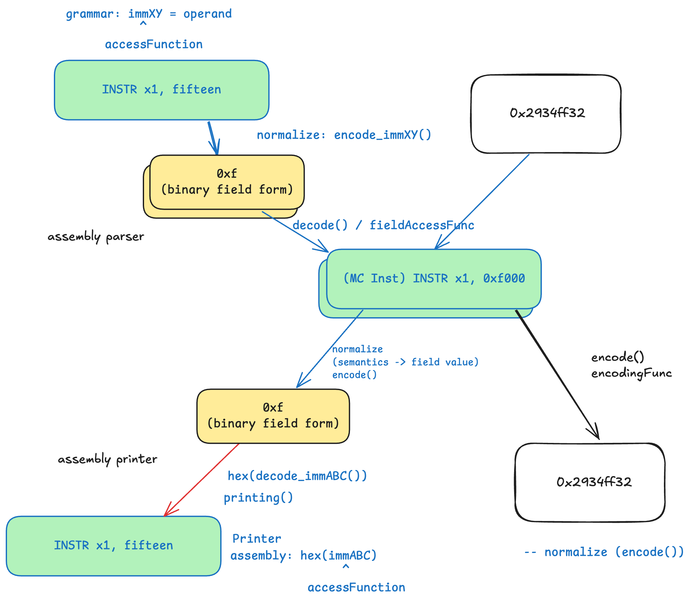

## LLVM Compiler Backend (LCB)

### Fields, Field Access Functions and Encodings

In a VADL specification, the format definitions declares how an instruction is represented in binary. A field is slice of an encoded value from this representation. The instruction behavior can reference a field to get the encoded value. A field access function can be used by the instruction behavior to access the decoded value from a field. The compiler generator will try to generate an encoding function which is the inverse function of the field access function. However, it cannot compute the inverse function automatically for all field access functions, so sometimes it is required to define an encoding function by hand.

The graphic above shows the flow of an operand in LLVM between Assembly Printer, Assembly Parser and generated binaries. There are three different representations of an immediate in LLVM. The first is the sementatic representation and represents the actual value of an immediate. The second representation is the assembly representation. Therefore, it depicts how the compiler emits and reads an immediate in an assembly file. The last representation is the encoded representation for the binary file. The assembly and the binary representation are often the same but could differ. To ease the development, the parser and printer need to normalize the value. The normalization is a function which converts a value (in assembly representation) to a value in LLVM. 

For example, consider the RISCV instruction `LUI`. An assembly instruction for this instruction is `LUI 0x12345`. However, this is not the actual value in LLVM because the value must be shifted. Therefore, let `n` be the normalization function where `n(x) = x << 12` and `n(0x12345) = 0x12345000`. In the emitter, we always emit the binary presentation. However, this creates a problem for the printer since we would need to convert it from `0x12345000` back to `0x12345`. Because, the code emitter always works with the binary encoding, we only need to check the assembly directive of the instruction whether print the human readable representation of the binary encoded value - so the instruction field value - or the LLVM value, which can be defined by using the field access function.
